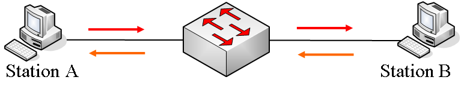
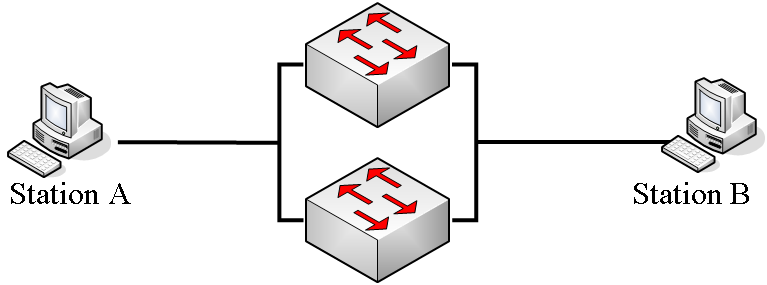
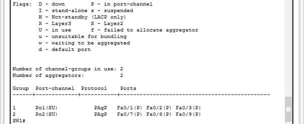

# UE3_Prosit2_RedondanceEtHauteDisponibilite

## Equipe
 * Emilien - Animateur
 * Raph - Secrétaire
 * Fantou - Scribe
 * Flo - Gestionnaire

## Mots-Clés

 * PVST : Per VLAN Spanning Tree
 * Boucle physique : Redondance, quand deux équipements forment physiquement une boucle
 * Boucle fermée
 * Aggregation de lien : 
 * Arbre recouvrant : 
 * Commutateur racine : 
 * Graph en arbre : 
 * HSRP (Host Standby Router Protocol) : 
 * Chemin le plus court : 
 * Tempête de diffusion : 
 * Commutatuer élu : 

## Contexte

### Quoi ?  
 Erreur dans la topologie (Pierre M)  
 Eviter les boucles infinie de requête ARP (Nicolas / Florian)

### Comment ?  
 En utilisant le PVST (Hugo)  
 En utilisant un algorythme de type arbre recouvrant (Maxime)

### Pourquoi ?  
 Réduire le nombre de transmission (Florian)

## Problématique
Comment réduire le trafic en retirant les boucles infinies ?

## Généralisation
Reconception  

## Hypothèses
 * Connaissance en théorie des graphes peuvent servir (Nico)
 * Dans un graph en arbre, les noeuds situés sur une même couches ne sont pas reliés entre eux (Max)

## Plan d'action
### Etudes
 * Spanning Tree
 	Protocole Spanning-Tree (STP - Spanning Tree Protocol) : Intervient lors d'installation de périphériques de redondance. C'est un protocole de niveau 2.  
 	La redondance c'est la multiplication d'un équipement pour prévenir la défaillance de l'un d'entre eux. On forme de ce fait une boucle, physique, permettant de passer par les deux équipements en même temps, les deux chemins étant toujours disponible, au cas ou une panne surviendrait.  
 	Sans redondance :
 	
 	Avec redondance :
 	

 	Les 3 problèmes majeurs rencontré avec cette configuration sans mettre en place de Spanning Tree :
 	 * La tempête de broadcast : Lorsqu'une trame de broadcast est envoyée par un périphérique hôte, elle est renvoyée sur tous les ports de chaque switch et une fois dans la boucle, elle tourne indéfiniment, faisant planter les switchs.
 	 * La duplication de trame : Lorsqu'une trâme est envoyée par un périphérique, elle passe par chaque switch et est donc multipliée par deux, provoquant un important trafic et pouvant déboucher sur des problèmes de réponse
 	 * L'instabilité de la table CAM : La table CAM de chaque switch se met à jour sur l'adresse MAC hôte lors de la reception d'un message puis le fait suivre vers l'interface de l'hôte de destination mais cette interface boucle également sur l'autre switch qui vient lui même d'envoyer le même message, et la réception du message venant du switch provoque une remise à jour de la table CAM, le port de l'hôte de provenance ayant changé.

 * PVST (Per VLAN Spanning Tree)
 	Mode de fonctionnement permettant au protocole STP de fonctionner indépendemment sur chaque VLAN existant. C'est le mode par défaut des switch Cisco.

 * Ethernet channel
 	Configuration de plusieurs liens physiques en un seul lien logique, permettant d'augmenter la bande passante (3 liens 100Mbit/s = Débit de 300Mbit/s)  
 	On utilise pour cela les protocoles PAgP (Port Aggration Protocol) et LACP (Link Aggregation Control Protocol) : 
 	 * PAgP : Protocole propriétaire Cisco, 3 statuts dans sa config, **On** qui déclare un agrégation active, **Desirable**, qui fait la demande avec le switch d'en face pour créer l'agrégation et **Auto** qui attend la négociation pour devenir une agrég.
 	 * LACP : Protocole standard et utilisé chez plusieurs constructeurs. il a également 3 status dans sa config, **On** qui déclare une agrég active, **Active**, qui fait la demande au switch d'en face et **Passive**, qui attend la négociation pour devenir une agrég.

 	Configuration avec PAgP :  
 	**Configuration Swich SW1  
	SW1>enable  
	SW1#configure terminal  
	SW1(config)#interface range fa0/1-3  
	SW1(config-if-range)#channel-group 1 mode desirable  
	SW1(config-if-range)#interface range fa0/7-9  
	SW1(config-if-range)#channel-group 2 mode desirable**  

	**Configuration Swich SW2  
	SW2>enable  
	SW2#configure terminal  
	Enter configuration commands, one per line. End with CNTL/Z.  
	SW2(config)#interface range fa0/1-3  
	SW2(config-if-range)#channel-group 1 mode auto  
	interface range fa0/4-6  
	SW2(config-if-range)#channel-group 3 mode desirable**

	**Configuration du Switch SW3  
	SW3>enable  
	SW3#configure terminal  
	Enter configuration commands, one per line. End with CNTL/Z.  
	SW3(config)#interface range fa 0/4-6  
	SW3(config-if-range)#channel-group 3 mode auto  
	SW3(config)#interface range fa 0/7-9  
	SW3(config-if-range)#channel-group 2 mode auto**

	Pour vérifier la configuration : '**SW1#show etherchannel summary**'
	

 * HSRP (Hot Standby Router Protocol)
 	Protocole Spanning tree au niveau des routeurs.

 * LACP (Link Aggregation Control Protocol)
 	Voir EthernetChannel

 * Théorie des graphes (Arbres binaires + Recherche en profondeur (et non pas en largeur))

 
 * Implémentation et paramétrage sur Cisco

### Réalisation
 * Réaliser une maquette des changements
 * Arbres Binaire - Langage au choix (Hacker Rank)
 * Recherche en profondeur (Hacker Rank)