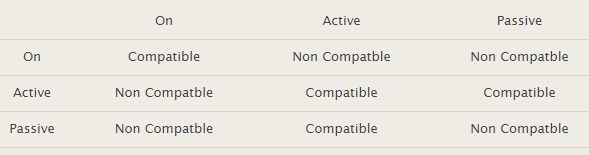

# UE3_Prosit2_RedondanceEtHauteDisponibilite

## Equipe
 * Emilien - Animateur
 * Raph - Secrétaire
 * Fantou - Scribe
 * Flo - Gestionnaire

## Mots-Clés

 * PVST : Per-VLAN Spanning Tree, protocole cisco permettant d'éviter les boucles
 * Boucle physique : -
 * Boucle fermée : -
 * Aggregation de lien : etherchannel, utilisations de plusieurs liens physique pour simuler un lien virtuel. Permet d'augmenter la bande passante
 * Arbre recouvrant : arbre couvrant d'un graphe en graph theory est un arbre inclus dans un graphe qui connecte tous les sommets du graphe
 * Commutateur racine :  racine du stanning tree
 * Graph en arbre : un graph non orienté dont 2 vertices (noeuds pour les faibles) sont connectées par un seul lien
 * HSRP (Host Standby Router Protocol) :  protocole Cisco permettant de créé une redondance de la passerelle par défaut
 * Chemin le plus court : -
 * Tempête de diffusion :  émission incessante de trames dût à une boucle physique 
 * Commutateur élu : commutateur racine
 * Tuple : liste ordonnée

## Contexte

### Quoi ?  
 Erreur dans la topologie (Pierre M)  
 Eviter les boucles infinie de requête ARP (Nicolas / Florian)

### Comment ?  
 En utilisant le PVST (Hugo)  
 En utilisant un algorythme de type arbre recouvrant (Maxime)

### Pourquoi ?  
 Réduire le nombre de transmission (Florian)

## Problématique
Comment réduire le trafic en retirant les boucles infinies ?

## Généralisation
Reconception  

## Hypothèses
 * Connaissance en théorie des graphes peuvent servir (Nico)
 * Dans un graph en arbre, les noeuds situés sur une même couches ne sont pas reliés entre eux (Max)

## Plan d'action
### Etudes
### PVST

Pb rencontrés par des redondances :

1 tempête de broadcast:

Si A envoie un broadcast:

Les deux switches reçoivent la trame et l'envoient sur tous leurs ports, la trame va donc vers l'autre switch et ils vont se la passer indéfiniment, spammant les end-users au passage

2 duplication de trame :

Si A envoie une trame vers B 

Les deux switches reçoivent la trame et l'envoie à la station B, la station B reçoit alors la trame en double

3 instabilité de la table CAM :

Si à envoie une trame vers B

Au niveau des tables CAM :

La trame arrive sur le port 1 du switch du haut, le switch extrait l'@MAC de source et l'insère dans sa table CAM, port 1 = @MAC A. De même pour le switch du bas pour son port 3, port 3 =  @MAC A

Il extrait ensuite l'@MAC de destination et la compare à sa table, il ne trouve aucune entrée et duplique donc la trame sur tous ses ports

Le switch du haut l'envoie sur le port 2 et celui du bas sur le port 4. Du coup chaque switch reçoit la trame envoyée par l'autre switch.

Le switch du haut reçoit la trame sur son port 2, extrait l'@MAC et change sa table CAM port 2 = @MAC A et supprime port 1 = @MAC A. De même pour le switch du bas port 4 = @MAC A et non plus le port 3

Le switch va donc devoir remettre à jour sa table CAM à chaque fois qu'il reçoit une trame (et toutes les dupliquer)

Résolution de ces problèmes:

Pour résoudre ces problèmes on utilise le protocole spanning-tree (de niveau 2, défini par la norme 802.1d). Les problèmes sont du à une boucle physique dans le réseau, ce protocole permet d'identifier la boucle et de la bloquer logiciellement, il bloque un port et le ré-active si besoin

#### config du Spanning Tree sur un switch

Par défaut le spanning-tree est actif sur les switches (mode pvst+). Il existe 2 autres modes : rapid pvst+ basé sur le protocole 802.1w et MSTP basé sur le protocole 802.1s

Dans certain cas, il est souhaitable de fixer les priorités par défaut. 
Le switch qui aura la priorité la plus basse sera élu root. On choisit un switch qui est placé en tête du réseau (backbone) puisque tout le trafic passe par lui. La priorité par défaut d'un switch est de 32768 et celle d'un port par défaut 128 si on décrémente ces chiffres le switch ou le port devient prioritaire par rapport aux autres

Pour activer le rapid pvst

	2960-RG(config)#spanning-tree mode rapid-pvst
Pour check les info du spanning tree

	2960-RG#sh spanning-tree [interface]

Définir un switch root pour un VLAN

	switch(config)#spanning-tree vlan 1-100 root primary
Configurer une priorité sur un port

	switch(config-if)#spanning-tree vlan 1-100 port-priority 64

Configurer des ports d'accès reliés à un switch

Au démarage d'un switch la recherche de la meilleure topologie peut prendre un peu de temps, pour rendre le démarage plus rapide on peut faire passer directement le port de l'état blocking à  l'état forwarding, on applique cette méthode pour les machines terminales (PC, imprimantes,...)

	2960-RG(config)#int range fa0/1 - 8
	2960-RG(config-if-range)#spanning-tree portfast

On peut check cette config avec

	2960-RG#sh run int fa0/1

### Etherchannel

L’objectif de l'agrégation de lien est d’augmenter la bande passante en fusionnant plusieurs liens physiques par un seul lien logique (norme IEEE 802.1AX)
Si j’utilise 3 liens de 100Mbit/s pour en faire un lien logique, le débit sera de 300Mbit/s
Dans le jargon Cisco, on parle également d’Etherchannel quand nous utilisons une agrégation de liens.
Une agrégation peut compter au maximum 8 interfaces physiques
Il existe 2 protocoles d’agrégation de lien qui sont PAgP et LACP. 

PAgP (Port Aggration Protocol) est un protocole propriétaire Cisco. Ce protocole utilise 3 statuts dans sa configuration :

* On : sert à déclarer une agrégation active (force l'agrégation)
* Desirable : C’est un mode qui fait la demande avec le switch d’en face pour créer l’agrégation (si en face en auto ou en desirable)
* Auto : C’est un mode qui attend la négociation pour devenir une agrégation. (si en face est desirable mais pas si il est en auto) 

Note : l'agrégation ne se fera pas si un seul port est en ON, si il est mal configuré le Mode ON peut créé des boucles que le spanning tree ne corrige pas

modes de compatibilité avec PAgP :

LACP (Link Aggregation Control Protocol), protocole standard qui peut communiquer avec différents constructeurs 
Il  utilise également 3 statuts dans sa configuration :
On : Sert à déclarer une agrégation active
Active : fait la demande avec le switch d’en face pour créer l’agrégation (= auto)
Passive : attend la négociation pour devenir une agrégation (= desirable)

modes de compatibilité LACP

config pour le schéma précédent

Configuration Swich SW1

	SW1(config)#interface range fa0/1-3
	SW1(config-if-range)#channel-group 1 mode desirable
	!
	SW1(config-if-range)#interface range fa0/7-9
	SW1(config-if-range)#channel-group 2 mode desirable

Configuration Swich SW2

	SW2(config)#interface range fa0/1-3
	SW2(config-if-range)#channel-group 1 mode auto
	!
	interface range fa0/4-6
	SW2(config-if-range)#channel-group 3 mode desirable

Configuration du Switch SW3

	SW3(config)#interface range fa 0/4-6
	SW3(config-if-range)#channel-group 3 mode auto
	!
	SW3(config)#interface range fa 0/7-9
	SW3(config-if-range)#channel-group 2 mode auto

Pour vérifier votre configuration d’agrégation :

	SW1#show etherchannel summary

On peut voir la création des port chanel avec
	
	show ip interface brief

Paramétrer le load ballancing :

	Switch-1(config)#port-channel load-balance [dst-mac ou src-mac]

### HSRP

Hot standby Router Protocol, protocole propriétaire cisco permettant de mettre en place un tolérance de panne pour une passerelle par défaut défini par la RFC2281, il est basé sur ARP pour IPv4 et les messages Router
Sollicitation et Router Advertisement pour IPv6

#### Fonctionnement

Tous les routeurs émulent une adresse IP virtuelle qui sera utilisée comme passerelle par défaut par les équipements du LAN.
Chaque routeur config sur HSRP avec un niveau de priorité, celui avec la priorité la plus haute sera celui actif et les autres seront en standby, si plusieurs routeurs possèdent la priorité la plus haute l"adresse IP la plus haute l'emportera

La communication entre les routeurs utilisant HSRP se fait via des paquets en multicast à l'adresse IP 224.0.0.1 vers le port UDP 1985 
Les hôtes IP du réseau LAN sont client du routeur virtuelle via l’adresse IP et l’adresse MAC émulées

L’adresse MAC émulée est du type 00:00:0C:07:AC:ZZ où ZZ représente le numéro du groupe.

En-tête

Champs:

Version : 1 octet 

Op code :  1 octet indique le type de message :

* 0 hello
* 1 coup
* 2 resign

State : 1 octet informe de 'l'état du routeur émettant ce datagramme HSRP

* initial
* 1 learn
* 2 listen
* 4 speak 
* 8 standby
* 16 active

Hellotime : 1octet intervale de temps en seconde entre chaque envoi de paquets Hello, lu que si l'Op code est 0

Holdtime : 1 octet temps en seconde entre de la validité des paquets hello, lu ssi OP code = 0

Priority :  1 octet permet d'élire le routeur actif (la plus haute)

Group : 1 octet permet l'utilisation de plusieurs HSRP sur le même LAN

Reserved 1 octet pour le futur

Authentifiaction data : codé sur 8 octets, contient le mdp de 8 caractères en clair. Dans le cas de non utilisation de l’authentification, il est fortement conseillé de paramétrer ce champ à la valeurs : 0x63 0x69 0x73 0x63 0x6F 0x00 0x00 0x00 (cisco en hexa)

Adresse IP virtuelle 4 octets contient l'@ IP  virtuelle 
#### Config

La commande « standby priority xxx » définit une priorité au routeur. Celui qui possédera la plus grande valeur sera élus actif. Si la configuration du routeur ne stipule pas la priorité, alors la valeurs par défaut de 100 sera appliquée.
La commande « standby preempt » permet d’accélérer le processus d’élection.
La commande « standby ip xxx.xxx.xxx.xxx » indique l’adresse IP virtuelle partagée entre les deux routeurs.
La commande « standby track xxxxxx » permet de superviser une interface et de baisser de 10 la valeur de la priorité HSRP si elle devenait Down.
La commande « standby authentication« , permet de remplacer le mot de passe par défaut « Cisco    » (63 69 73 63 6F 00 00 00).

 R1
 
	R1(config)#interface fastEthernet0/1
	R1(config-if)#ip address 192.168.0.1 255.255.255.0
	R1(config-if)#standby 1 ip 192.168.0.254
	R1(config-if)#standby 1 priority 110
	R1(config-if)#standby 1 preempt
	R1(config-if)#standby 1 track Serial 0/0 11
	R1(config-if)#no shutdown
	R1(config-if)#exit

R2

	R2(config)#interface fastEthernet0/1
	R2(config-if)#ip address 192.168.0.2 255.255.255.0
	R2(config-if)#standby 1 ip 192.168.0.254
	R2(config-if)#standby 1 preempt
	R2(config-if)#standby 1 track Serial 0/0 1
	R2(config-if)#no shutdown
	R2(config-if)#exit

Vérif :

	R1# show standby

#### Problème de sécurité 

Le protocole HSRP possède deux principales faiblesses qui sont le passage du mot de passe d’authentification en claire et l’acceptation de paquet unicast.

Mot de passe d’authentification en claire
Le protocole HSRP utilise pour authentifier les requêtes, un mot de passe qui transite en clair sur le réseau LAN. De plus, comme le protocole s’appui sur une adresse IP de destination de type Multicast afin de s’adresser à tous les routeurs, l’écoute de ce mot de passe est très simple et ne demande aucune action particulière même dans le cadre de réseau commuté.

Acceptation d'unicast 

Bien que les messages HSRP soient de type Multicast, les paquets de type Unicast (datagramme dirigé) sont acceptés et traités par les routeurs HSRP.

Cela signifie que les paquets HSRP, ayant pour adresse de destination le routeur physique, seront traités par ce dernier sans différence. Ce comportement permet aux attaques d’être exécutées à distance en s’affranchissant des contraintes de sécurité liées au trafic Multicast.

#### Protection 

Changer le groupe 	pour diminuer les chances d'attaques par des bots

on doit le faire pour chaque commande, par exemple pour utilisr le groupe 3 

	 ip address 192.168.101.253 255.255.255.0
	 standby 3 priority 120
	 standby 3 preempt
	 standby 3 ip 192.168.101.254 

Définir un mot de passe 

standby 3 authentication [motdepasse]

Appliquer un filtre IP :

en bordure du LAN appliquer un filtre IP permettant d’interdire les flux de type UDP 1985 d’entrer. Ainsi, vous serez protégé contre toutes les attaques distantes.

Sur chaque routeur : 
Appliquer un filtre IP sur ses flux entrants autorisant pas la réception de datagramme UDP 1985 provenant uniquement des routeurs de son groupe HSRP 

IPSEC:
CISCO propose d’installer IPSec entre les routeurs HSRP membre du groupe afin de chiffrer les communications HSRP et par conséquent la clé d’authentification.

Utiliser le MD5 (mais bon il est broken maintenant)

Cisco propose d’utiliser l’algorithme MD5 afin de Hash les échanges. Dans ce cas précis, le mot de passe n’est plus transité dans le champs « Authentification data » qui devient alors égale à 0. Pour cela, il faut rajouter la commande suivante dans tous les routeurs membre du groupe HSRP :

	standby 3 authentication md5 key-string toto

VRRP :

La solution radicale est de ne pas utiliser le protocole Cisco HSRP, mais de préférer VRRP (Virtual Router Redundancy Protocol).

### LACP
### Théorie des graphes (Arbres binaires + Recherche en profondeur (et non pas en largeur))
### Arbres binaires  :

bifurcating arborescence

peut être défini récursivement comme un tuple (L,S, R) où L et R sont des arbres binaire ou l'ensemble vide et S un ensemble singleton

### Implémentation et paramétrage sur Cisco

### Réalisation
 * Réaliser une maquette des changements
 * Arbres Binaire - Langage au choix (Hacker Rank)
 * Recherche en profondeur (Hacker Rank)
